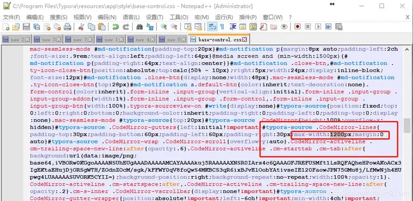
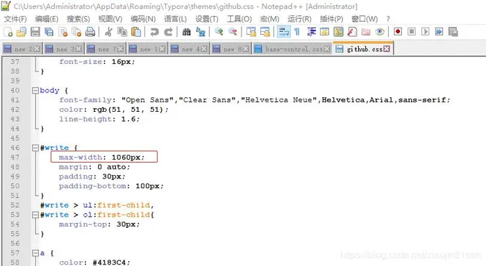

# Typora - Markdown编辑工具

应用非常广泛的Markdown文档编辑工具软件，虽然当前已经开始收费，价格 90 元人民币，可以注册 3 台电脑，算不上贵。  
※如果觉得注册比较麻烦，也有免费版本，足够应付我们的平日工作。

## 1. 下载及安装

- 官方下载地址：

  https://typora.io/

- 最后免费版本的下载地址：

  https://www.typora.io/windows/dev_release.html?utm_source=0xo.net

  `0.11.18` 版本，只有 [Linux](https://download.typora.io/linux/typora_0.11.18_amd64.deb) 的版本是真实免费的。（2022.12.15验证，这些链接都已经无法下载）
  
  Windows的免费版本，只有一个 `0.9.98` ：
  
  - [Download old version (Windows x64)](https://download.typora.io/windows/typora-update-x64-1213.exe) 
  - [Download old version (Windows x86)](https://download.typora.io/windows/typora-update-ia32-1213.exe) 
  - [Download old version (Linux x64)](https://download.typora.io/linux/typora_0.9.98_amd64.deb)
  
- 其它下载地址：

  | 地址                                                         | 版本                    | 备注                                                         |
  | ------------------------------------------------------------ | ----------------------- | ------------------------------------------------------------ |
  | https://typora.jp.uptodown.com/windows/versions              | Windows 多个旧版本      | 至少 0.9.9.96 是完全免费的                                   |
  | https://github.com/iuxt/src/releases/download/2.0/typora-setup-x64_0.9.96.exe | Windows x64 0.9.96      |                                                              |
  | https://github.com/iuxt/src/releases/download/2.0/Typora_Linux_0.11.18_amd64.deb | Linux（Ubuntu、Debian） | Linux_0.11.18_amd64.deb                                      |
  | https://github.com/iuxt/src/releases/download/2.0/typora-0-11-18.dmg | Mac                     |                                                              |
  | https://github.com/iuxt/src/releases/download/2.0/typora-0-11-18.tar.gz | Linux（Debian系以外）   |                                                              |
  | https://zahui.fan/posts/64b52e0d/                            | 各个免费版本及安装办法  | [DEB](https://github.com/iuxt/src/releases/download/2.0/Typora_Linux_0.11.18_amd64.deb) [WIN](https://github.com/iuxt/src/releases/download/2.0/typora-setup-x64_0.9.96.exe) [MAC](https://github.com/iuxt/src/releases/download/2.0/typora-0-11-18.dmg) |

### 1.1 Ubuntu 指令安装

- 安装指令：

  ※仅仅是为了说明安装办法，不要用该办法安装。它最大的问题是，这个安装是安装的当前最新版本，没有许可是不可长期使用的，还是下载最后的免费版本比较合适。

  ```bash
  # 添加 Typora 的公共键
  wget -qO - https://typora.io/linux/public-key.asc | sudo apt-key add -
  
  # 添加 Typora 的软件仓库
  sudo add-apt-repository 'deb https://typora.io/linux ./'
  
  # 软件更新
  sudo apt-get update
  
  # 安装 Typora
  sudo apt-get install typora
  ```

## 2. 调整源码编辑区域宽度

Typora的源码编辑宽度很窄，可能是为了照顾老用户？只有800px，对当前流行电脑的分辨率来说，实在是太窄了，工作起来也非常别扭。

### 2.1 Windows 版本

- 在 `C:\Program Files\Typora\resources\app\style\` 下，找到 `base-control.css` 文件；

  最新版本已经修改为 `C:\Program Files\Typora\resources\style` 的目录下，找不到的话，可以直接搜索该文件。

  - Winget安装的话：  
    `C:\Users\%UserName%\AppData\Local\Programs\Typora\resources\style`

- 打开后搜索 `#typora-source` 更改其最大宽度 `max-width` 为`1200` ，不过设置文件中有多处 `max-width` ，应该是第三个的位置？原始数值是`800` ；

  懒惰的话，可以直接搜索 `padding-right:30px;max-width:` ，这个项目只有 1 个，找起来很方便。

  修改的情况如图所示：

  

### 2.2 Linux 版本

- Ubuntu - Linux

  软件安装位置：`/usr/share/typora/resources/style`

## 3. 修改编辑器（主题） 的宽度

这个编辑宽度也可能是为了照顾所有的显示器，编辑宽度显得比较局促。

### 3.1 Windows 版本

- 普通编辑器的配置文件 并不在 Typora 的安装目录， 是在 `C:\Users\%UserName%\AppData\Roaming\Typora\themes` 目录下；

  ※`Administrator`是电脑当前的用户名，按照自己的实际用户名替换该字符。

- 主题有 github.css、newsprint.css、night.css、pixyll.css、whitey.css 。

  选择使用主题的css文件，搜索 `#write` ，修改其属性 `max-width` 为 `1060px` 。所图所示：

  

  现在大家的屏幕宽度至少都是 1920 ，应该是修改下面的区域的数据：

  ```
  @media only screen and (min-width: 1800px) {
  	#write {
  		max-width: 1200px;
  	}
  }
  ```

  如果不想用像素 1200px 方式，可以设置为 `90%` 的比例数据；考虑到个人一直会在左侧显示大纲内容，用比例方式是更为合适的。

### 3.2 Linux 版本

- Linux 版本的话，主题宽度调整的文件处于如下位置：

  **DEEPIN**：`/opt/apps/io.typora/files/typora/resources/style/themes`
  
  但是，为啥即使修改了，也一直不起效？？？
  
  **Ubuntu**：`~/.config/Typora/themes`

## 4. 卸载

网上有这样的说法，然而好像没有解决问题。

1. 打开控制面板，双击添加和删除程序，选择Typora后，右键卸载。

   我的电脑安装的版本，就没有找到该项目，可以在下面的目录里面找到卸载方法：

   ```
   C:\Users\%UserName%\AppData\Local\Programs\
   ```

2. 删除Typora残留的文件，使用下面的命令：

   ```
   DEL /F /Q "C:\Users\%USERNAME%\AppData\Roaming\Typora\profile.data"
   REG delete HKEY_CURRENT_USER\SOFTWARE\Typora /f
   ```

