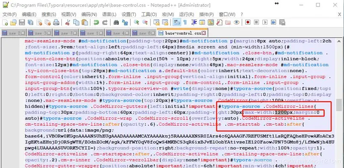
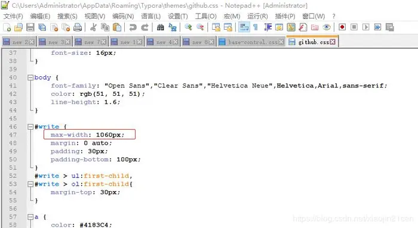

# Typora - Markdown编辑工具

应用非常广泛的Markdown文档编辑工具软件，虽然当前已经开始收费，价格 90 元人民币，可以注册 3 台电脑，算不上贵。  
**※** 如果觉得注册比较麻烦，也有免费版本，足够应付我们的平日工作。

## 1. 下载及安装

- 官方下载地址：

  https://typora.io/  
  https://typora.io/releases/stable.html  
  ※ 官方网站只提供从 1.0.0 开始的正式版本。

- 最后免费版本的下载地址：

  https://www.typora.io/windows/dev_release.html?utm_source=0xo.net

  `0.11.18` 版本，只有 [Linux](https://download.typora.io/linux/typora_0.11.18_amd64.deb) 的版本是真实免费的。（2022.12.15验证，这些链接都已经无法下载）
  
  Windows的免费版本，只有一个 `0.9.98` ：
  
  - [Download old version (Windows x64)](https://download.typora.io/windows/typora-update-x64-1213.exe) 
  - [Download old version (Windows x86)](https://download.typora.io/windows/typora-update-ia32-1213.exe) 
  - [Download old version (Linux x64)](https://download.typora.io/linux/typora_0.9.98_amd64.deb)
  
- 其它下载地址：

  | 地址                                                         | 版本                    | 备注                                                         |
  | ------------------------------------------------------------ | ----------------------- | ------------------------------------------------------------ |
  | https://typora.jp.uptodown.com/windows/versions              | Windows 多个旧版本      | 至少 0.9.96 是完全免费的                                     |
  | https://github.com/iuxt/src/releases/download/2.0/typora-setup-x64_0.9.96.exe | Windows x64 0.9.96      |                                                              |
  | https://github.com/iuxt/src/releases/download/2.0/Typora_Linux_0.11.18_amd64.deb | Linux（Ubuntu、Debian） | Linux_0.11.18_amd64.deb                                      |
  | https://github.com/iuxt/src/releases/download/2.0/typora-0-11-18.dmg | Mac                     |                                                              |
  | https://github.com/iuxt/src/releases/download/2.0/typora-0-11-18.tar.gz | Linux（Debian系以外）   |                                                              |
  | https://zahui.fan/posts/64b52e0d/                            | 各个免费版本及安装办法  | [DEB](https://github.com/iuxt/src/releases/download/2.0/Typora_Linux_0.11.18_amd64.deb) [WIN](https://github.com/iuxt/src/releases/download/2.0/typora-setup-x64_0.9.96.exe) [MAC](https://github.com/iuxt/src/releases/download/2.0/typora-0-11-18.dmg) |

### 1.1 Ubuntu 指令安装

- 安装指令：

  ※仅仅是为了说明安装办法，不要用该办法安装。它最大的问题是，这个安装是安装的当前最新版本，没有许可是不可长期使用的，还是下载最后的免费版本比较合适。

  ```bash
  # 添加 Typora 的公共键
  wget -qO - https://typora.io/linux/public-key.asc | sudo apt-key add -
  
  # 添加 Typora 的软件仓库
  sudo add-apt-repository 'deb https://typora.io/linux ./'
  
  # 软件更新
  sudo apt-get update
  
  # 安装 Typora
  sudo apt-get install typora
  ```

## 2. 调整源码编辑区域宽度

Typora的源码编辑宽度很窄，可能是为了照顾老用户？只有800px，对当前流行电脑的分辨率来说，实在是太窄了，工作起来也非常别扭。

### 2.1 Windows 版本

- 找到 `base-control.css` 文件位置  
  
  | 版本区分         | 位置                                                         | 备注 |
  | ---------------- | ------------------------------------------------------------ | ---- |
  | 旧版本           | `C:\Program Files\Typora\resources\app\style\`               |      |
  | 新版本           | `C:\Program Files\Typora\resources\style`                    |      |
  | Winget安装的版本 | `C:\Users\%UserName%\AppData\Local\Programs\Typora\resources\style` |      |
  
- 打开后搜索 `#typora-source` 更改其最大宽度 `max-width` 为`1200` ，不过设置文件中有多处 `max-width` ，应该是第三个的位置？原始数值是`800px` ；  
  懒惰的话，可以直接搜索 `padding-right:30px;max-width:` ，这个项目只有 1 个，找起来很方便。  
  ```
  padding-right:30px;max-width:
  ```
  修改的情况如图所示：  
  

#### 备注：新版本

新版本的 `Typora` 的源代码修改，已经发生了改变，也转移到了 `C:\Users\%UserName%\AppData\Local\Programs\Typora\resources\style` 的 `base-control.css` 文件中。

- 大概在如下位置：

  ```css
  #typora-source .CodeMirror-lines {
    /* ... 其他属性 ... */
    max-width: 860px; /* 或其他值 */
    /* ... 其他属性 ... */
  }
  ```

  ※ 直接搜索 `#typora-source .CodeMirror-lines` 即可，文件中只有一个，不会出现歧义。找到 `max-width` 项目，修改为 `90%`，或者希望没有边框的话，设置为 `none` 即可。

  **💡 注意：**

  - `base-control.css` 文件控制着 Typora 核心 UI 的样式。
  - 如果您修改的是 **预览/编辑模式** 下的文本宽度（而不是源代码模式），则需要修改您当前**使用的主题**对应的 `.css` 文件（例如 `github.css`），并搜索 **`#write`** 元素下的 `max-width` 属性。

### 2.2 Linux 版本

- Ubuntu - Linux

  软件安装位置：`/usr/share/typora/resources/style`
  
  ```
  cd /usr/share/typora/resources/style
  sudo chmod 777 base-control.css
  sudo nano base-control.css
  sudo chmod 644 base-control.css
  ```
  
  

## 3. 修改编辑器（主题） 的宽度

这个编辑宽度也可能是为了照顾所有的显示器，编辑宽度显得比较局促。

### 3.1 Windows 版本

- 普通编辑器的配置文件 并不在 Typora 的安装目录， 是在如下目录下：  

  ```
  C:\Users\%UserName%\AppData\Roaming\Typora\themes
  ```

  ※`Administrator`是电脑当前的用户名，按照自己的实际用户名替换该字符。

  打开相应的 CSS 文件，查找如下内容：

  ```
  max-width:
  ```

- 主题有 github.css、newsprint.css、night.css、pixyll.css、whitey.css 。

  选择使用主题的css文件，搜索 `#write` ，修改其属性 `max-width` 为 `1060px` 。所图所示：  
  

  现在大家的屏幕宽度至少都是 1920 ，应该是修改下面的区域的数据：

  ```
  @media only screen and (min-width: 1800px) {
  	#write {
  		max-width: 1200px;
  	}
  }
  ```

  如果不想用像素 `1200px` 方式，可以设置为 `90%` 的比例数据；考虑到个人一直会在左侧显示大纲内容，用比例方式是更为合适的。例如修改为如下内容：  
  
  ```
  #write {
      max-width: 90%;
  }
  
  
  @media only screen and (min-width: 1400px) {
  	#write {
  		max-width: 90%;
  	}
  }
  
  @media only screen and (min-width: 1800px) {
  	#write {
  		max-width: 90%;
  	}
  }
  ```
  
  ※ 小屏幕电脑的话，可以设置为比例 `95%` 更加合适。

### 3.2 Linux 版本

- Linux 版本的话，主题宽度调整的文件处于如下位置：

  **DEEPIN**：`/opt/apps/io.typora/files/typora/resources/style/themes`
  
  但是，为啥即使修改了，也一直不起效？？？
  
  **Ubuntu**：`~/.config/Typora/themes`
  
  修改指令如下：
  
  ```
  cd  /usr/share/typora/resources/style/themes/
  sudo chmod 777 night.css
  sudo nano night.css
  sudo chmod 644 night.css
  ```
  
  

## 4. 软件卸载

网上有这样的说法，然而好像没有解决问题。

1. 打开控制面板，双击添加和删除程序，选择Typora后，右键卸载。

   我的电脑安装的版本，就没有找到该项目，可以在下面的目录里面找到卸载方法：

   ```
   C:\Users\%UserName%\AppData\Local\Programs\
   ```

2. 删除Typora残留的文件，使用下面的命令：

   ```shell
   DEL /F /Q "C:\Users\%USERNAME%\AppData\Roaming\Typora\profile.data"
   REG delete HKEY_CURRENT_USER\SOFTWARE\Typora /f
   ```

## 5. 快捷键

| #            | 功能                            | 快捷键                                               | 备注                               |
| ------------ | ------------------------------- | ---------------------------------------------------- | ---------------------------------- |
| **文件操作** |                                 |                                                      |                                    |
|              | 新建                            | Ctrl + N                                             |                                    |
|              | 打开                            | Ctrl + O                                             |                                    |
|              | 快速打开                        | Ctrl + P                                             |                                    |
|              | 重新打开已经关闭文件            | Ctrl+ Shift + T                                      |                                    |
|              | 保存                            | Ctrl + S                                             |                                    |
|              | 另存为                          | Ctrl + Shift + S                                     |                                    |
|              | 打印                            | Alt + shift + P                                      |                                    |
|              | 关闭窗口                        | Ctrl + W                                             |                                    |
| **复制粘贴** |                                 |                                                      |                                    |
|              | 复制                            | Ctrl + C                                             |                                    |
|              | 复制为MarkDown                  | Ctrl + Shift + C                                     |                                    |
|              | 剪切                            | Ctrl + X                                             |                                    |
|              | 黏贴                            | Ctrl + V                                             |                                    |
|              | 黏贴为纯文本                    | Ctrl + Shift + V                                     |                                    |
| **撤销重做** |                                 |                                                      |                                    |
|              | 撤销                            | Ctrl + Z                                             |                                    |
|              | 重做                            | Ctrl + Y                                             |                                    |
| **标题段落** |                                 |                                                      |                                    |
|              | 标题1~6                         | Ctrl + 1/2/3/4/5/6                                   |                                    |
|              | 段落                            | Ctrl + 0                                             |                                    |
|              | 提高标题                        | Ctrl + +                                             |                                    |
|              | 降低标题                        | Ctrl + -                                             |                                    |
| **表格操作** |                                 |                                                      |                                    |
|              | 插入表                          | Ctrl + T                                             |                                    |
|              | 选中当前行                      | Ctrl + L                                             | 遇到句号就结束。                   |
|              | 选中相同格式的文字              | Ctrl + E                                             | 选中表格中的内容                   |
|              | 添加 1 行                       | Ctrl + Enter                                         |                                    |
|              | 行上移                          | Alt + ↑                                              |                                    |
|              | 行下移                          | Alt + ↓                                              |                                    |
|              | 列左移                          | Alt + ←                                              |                                    |
|              | 列右移                          | Alt + →                                              |                                    |
|              | 行删除                          | Ctrl + Shift + Backspace                             |                                    |
| **列表操作** |                                 |                                                      |                                    |
|              | 有序列表                        | Ctrl + Shift + [                                     | 数字. + 空格                       |
|              | 无序列表                        | Ctrl + Shift + ]                                     | - + 空格                           |
|              | 列表缩进                        | Ctrl + [<br />Tab                                    |                                    |
|              | 减少缩进                        | Ctrl + ]<br />Shift + Tab                            |                                    |
| **文字编辑** |                                 |                                                      |                                    |
|              | 加粗                            | Ctrl + B                                             | 代码：`**加粗文字**` `_加粗字体__` |
|              | 倾斜                            | Ctrl + I                                             | `*倾斜文字*`                       |
|              | 下划线                          | Ctrl + U                                             | `<ul>下划线文字</ul>`              |
|              | 删除线                          | Alt+Shift+5                                          | `~~内容~~`                         |
|              | 分割线                          | *** + 回车<br />--- + 回车                           |                                    |
|              | 插入超链接                      | Ctrl + K<br />Ctrl + Shift + I                       | `[]()`                             |
|              | 插入代码                        | Ctrl + Shift + `                                     |                                    |
|              | 插入代码块                      | Ctrl + Shift + K                                     | ````xml`，插入的就是xml格式        |
|              | 插入公式块                      | Ctrl + Shift + M                                     |                                    |
|              | 插入任务列表复选框<br />TO_List | \- +空格+[ 空格] + 空格  <br />++空格+[ 空格] + 空格 | \- [ ] 未选中<br />- [x] 选中      |
|              | 插入任务列表                    | Ctrl + shift + X                                     |                                    |
|              | 选择段落或块                    | Alt + Ctrl + P                                       |                                    |
|              | 删除块                          | Alt + Ctrl + shift + P                               |                                    |
|              | 删除当前行或句                  | Alt + Ctrl + shift + L                               |                                    |
|              | 删除当前格式文本                | Alt + Ctrl + shift + E                               |                                    |
|              | 选中单词                        | Ctrl + D                                             |                                    |
|              | 选择样式范围                    | Ctrl + E                                             |                                    |
|              | 选择行/句                       | Ctrl + L                                             |                                    |
|              | 选择全部                        | Ctrl + A                                             |                                    |
| **查找替换** |                                 |                                                      |                                    |
|              | 查找                            | Ctrl + F                                             |                                    |
|              | 替换                            | Ctrl + H                                             |                                    |
|              | 查找下一个                      | F3                                                   |                                    |
|              | 查找上一个                      | Shift + F3                                           |                                    |
| **放大缩小** |                                 |                                                      |                                    |
|              | 放大                            | Ctrl + Shift + +                                     |                                    |
|              | 缩小                            | Ctrl + Shift + -                                     |                                    |
|              | 真实100%大小                    | Ctrl + Shift + 0                                     |                                    |
|              | 实际大小                        | Ctrl + shift + 9                                     |                                    |
| **视图操作** |                                 |                                                      |                                    |
|              | 打开大纲视图                    | Ctrl + Shift + 1                                     |                                    |
|              | 打开文档列表视图                | Ctrl + Shift + 2                                     |                                    |
|              | 打开文件树视图                  | Ctrl + Shift + 3                                     |                                    |
| **工作模式** |                                 |                                                      |                                    |
|              | 打字机模式                      | Fn + F9                                              |                                    |
|              | 专注模式                        | Fn + F8                                              |                                    |
|              | 全屏                            | Fn + F11                                             |                                    |
|              | 进入源码格式                    | Ctrl + /                                             | 再次按退出源码格式                 |
| **光标跳转** |                                 |                                                      |                                    |
|              | 跳转到光标所在位置              | Ctrl + J                                             | 跳转到所选内容                     |
|              | 跳转到行首                      | Home                                                 |                                    |
|              | 跳转到行尾                      | End                                                  |                                    |
|              | 跳转到文章开头                  | Ctrl + Home                                          |                                    |
|              | 跳转到文章结尾                  | Ctrl + End                                           |                                    |
| **其它操作** |                                 |                                                      |                                    |
|              | 引用                            | Ctrl + Shift + Q                                     | \> + 空格                          |
|              | 生成目录                        | [TOC] + 回车                                         |                                    |
|              | 表情                            | :表情英文单词：                                      | `例如:smile:`:smile:               |
|              | 快捷操作弹窗                    | Shift + F10                                          |                                    |
|              | 开发者工具                      | Shift + F12                                          |                                    |
|              | 搜索                            | Ctrl + shift + F                                     |                                    |
|              | 新窗口                          | Ctrl + Shift + N                                     |                                    |
|              | 在打开的文档之间切换            | Ctrl + Tab                                           |                                    |
|              | 切换                            | DevToolsCtrl + Shift + I                             | 不明                               |

### 扩展语法

设置扩展语法，否则这些扩展语法无法起效。

- 打开Typora；
- 点击文件，选择偏好设置；
- 选择Markdown；
- 勾选Markdown扩展语法的下标选项；
- 重启Typora。

**脚注**

- `[^1]：创建一个脚注[1]，输入文字后，在其后输入半角中括号，再在中括号中输入和数字即可，试试[2]，再试试3，输入脚注后，还要在页尾右键，插入脚注内容，这样脚本内容才会出现在数字的onMouseOver浮框中。`

**下标**

- `输入<sub/>来包裹要作为下标的内容就好，如H2O` H<sub/>2O

**上标**

- `输入<sup/>来包裹要作为上标的内容就好，如X2`

## 6. 流程图、顺序图

- 参照如下网址：

  https://qiita.com/4_mio_11/items/223326c3289f6b2c2a07


## 附1：代替软件

鉴于 `1.0.0` 版本之后开始收费，可以选择 `MarkText` 。

- 通过安装向导 (marktext-setup-%version%.exe) 下载并安装 `MarkText`。

- 使用 `winget` 进行安装  

  ```bahs
  winget install marktext
  ```

  

# Markdown - 编辑技巧

## 1. 可折叠文本框

### 1.1 可折叠文本框语法

在 Standard Markdown 中，可以使用 HTML 的 `<details>` 和 `<summary>` 标签来实现可折叠文本框。大多数主流 Markdown 渲染器（如 GitHub、Gitee、Notion、VS Code 等）都完全支持这种写法。

- **基本语法**

  ```html
  <details>
  <summary>点击展开 / 折叠</summary>
  
  这里是折叠框内部的隐藏内容。
  支持编写多行文本。
  
  </details>
  ```

- **进阶：在折叠框内使用 Markdown 格式（代码块、列表等）**

  如果你想在折叠框内部使用 Markdown 的语法（例如**加粗**、`行内代码`、代码块或列表），**必须在 `<summary>` 标签下方留出一行空行**：

  ~~~html
  <details>
  <summary>点击查看代码示例</summary>
  
  <!-- 注意：上方必须留一个空行 -->
  
  ### 标题
  * 列表项 1
  * 列表项 2
  
  ```javascript
  console.log("Hello, World!");
  ~~~

- **默认展开状态**

  在 `<details>` 标签中添加 `open` 属性：

  ```html
  <details open>
  <summary>默认展开的文本框（点击可收起）</summary>
  
  这里的内容默认就会显示出来。
  
  </details>
  ```

### 1.2 GitHub / GitLab 上使用

为了确保在 GitHub/GitLab 网页端渲染时不出现格式混乱，编写时需注意以下两点：

1. 折叠框内写 Markdown 语法必须空行
  如果在折叠内容里使用了 Markdown（如代码块、列表、加粗等），<summary> 标签下方必须留出至少一行空行，否则 GitHub/GitLab 会把内部内容直接当成纯文本或解析失败。

  ~~~html
  <details>
  <summary>点击查看 GitLab/GitHub 上的代码示例</summary>
  
  <!-- 上方一定要空一行 -->
  
  ```python
  def hello():
      print("GitHub & GitLab 都完美支持折叠框！")
  ~~~

2. `<summary>` 标题尽量保持在同一行
  `<summary>` 标签和其中的提示文字最好写在同一行，避免在不同平台产生意料之外的换行行为：

  ```html
  <!-- 推荐写法 -->
  <summary>点击展开详细日志</summary>
  
  <!-- 尽量避免跨行 -->
  <summary>
    点击展开详细日志
  </summary>
  ```

  
